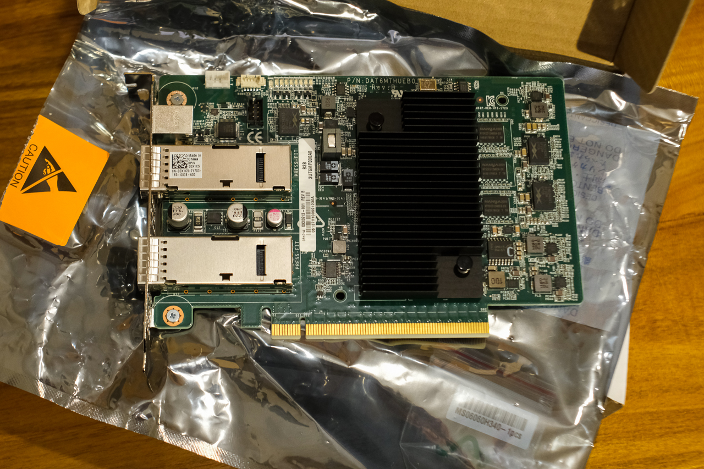
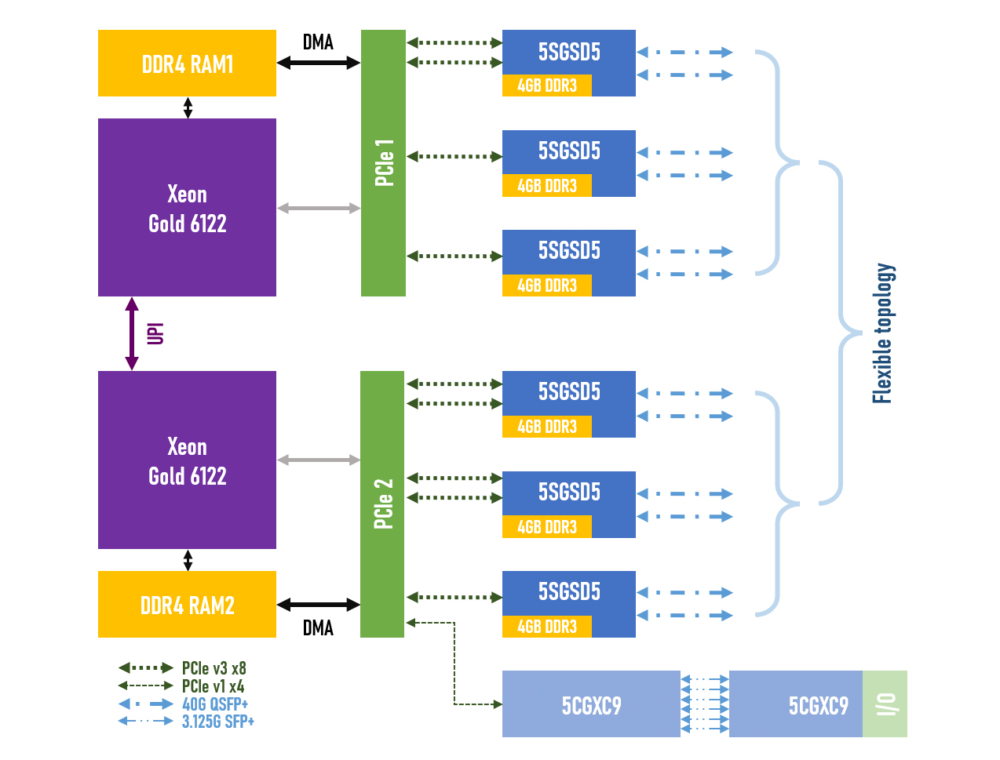
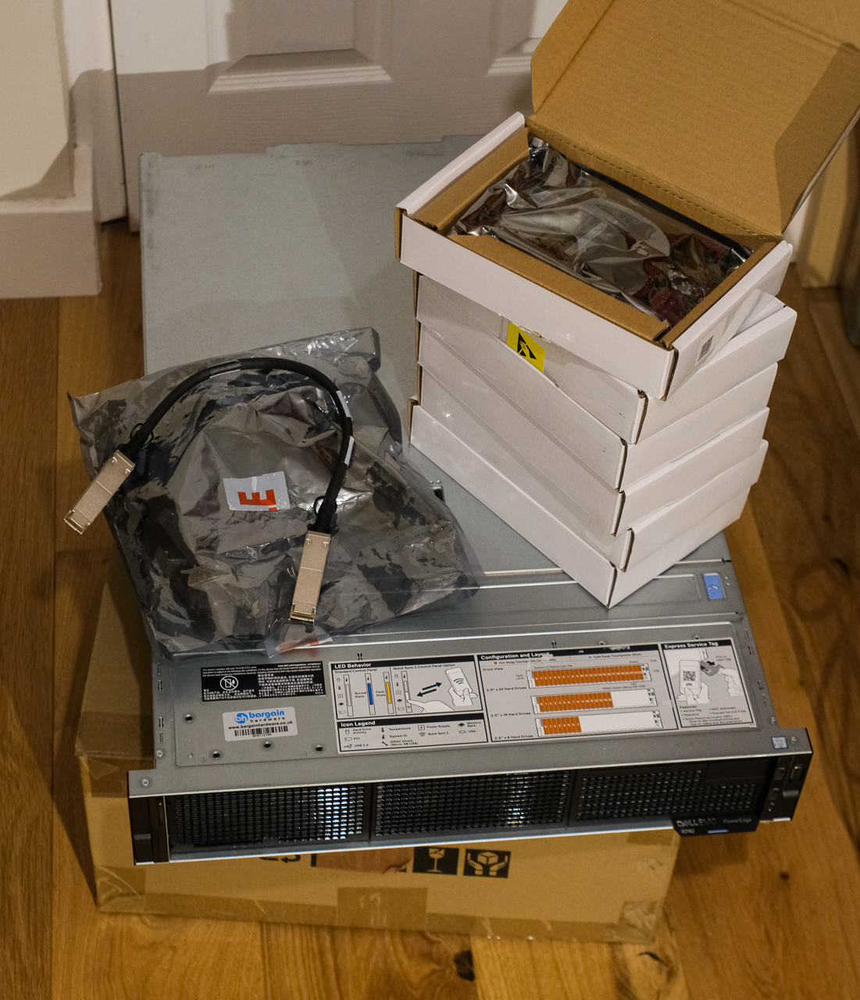

For the last two years, I have been curious about how the reconfigurability of FPGAs could be taken advantage of for accelerating modern HPC tasks (more specifically, those implementing deep neural networks). Inspired by work such as [[Microsoft Brainwave]](https://www.microsoft.com/en-us/research/wp-content/uploads/2018/06/ISCA18-Brainwave-CameraReady.pdf), [[ETH Enzian]](https://enzian.systems/assets/publications/enzian-asplos-2022.pdf) and [[Flexible Network FPGA Clusters]](https://dl.acm.org/doi/10.1145/3020078.3021742), I decided to build a system of my own, even though such hardware is not easily accessible at the scale of the home user. Fortunately, with some willingness to research and dig through listings for decommissioned data centre equipment, a capable experimentation platform can be built for an investment of roughly £400.

## Microsoft 'Storey Peak' card
Cards from Microsoft's [[Catapult v2 project]](https://www.microsoft.com/en-us/research/wp-content/uploads/2016/10/Cloud-Scale-Acceleration-Architecture.pdf) can be acquired for 20-30£ a piece, or - with some luck - less in eBay bulk auctions. They feature a generously sized custom Intel Stratix V FPGA (457K LE, 690K registers, DSP variant) and, importantly, 9x 4Gbit onboard RAM modules. The transceivers connect to two separate PCIe v3 x8 hard IP blocks and two QSFP+ cages used for 40GbE, which may be repurposed for FDR Infiniband or a simpler proprietary protocol up to 4*14.1 Gbps.

Apart from the price point, a major advantage of these cards is the considerable amount of reverse engineering work done on them [[blog]](https://j-marjanovic.io/) [[GitHub]](https://github.com/wirebond/catapult_v2_pikes_peak) [[GitHub]](https://github.com/ruurdk/storey-peak) - to the extent that a basic Quartus template project is readily available [[GitHub]](https://github.com/j-marjanovic/pp-sp-reference-design).



## The system
The figure below shows the block diagram of the complete system based on a Dell PowerEdge R740 host server, which was chosen mainly for its PCIe expansion capabilities: 8 slots in a 2U chassis with versatile bifurcation support. Three Stratix V FPGA cards are connected to each CPU's PCIe interface, but only three cards can utilise both of their x8 links. This will not be a limiting factor given the RAM bottleneck (6 single-port channels @2400 MT/s per CPU), especially as data transfer between the cards may take place directly through the network ports. The routing topology is flexible and can be implemented using direct attach cables, offering a very economical solution.

Additionally, a large Cyclone V-based card (or expanded card array) with an ample number of generic IO ports facilitates sensor integration.



The ingredients:


```md
Follow-up projects will be uploaded as I progress through the exciting tasks: writing HDL code.
```
