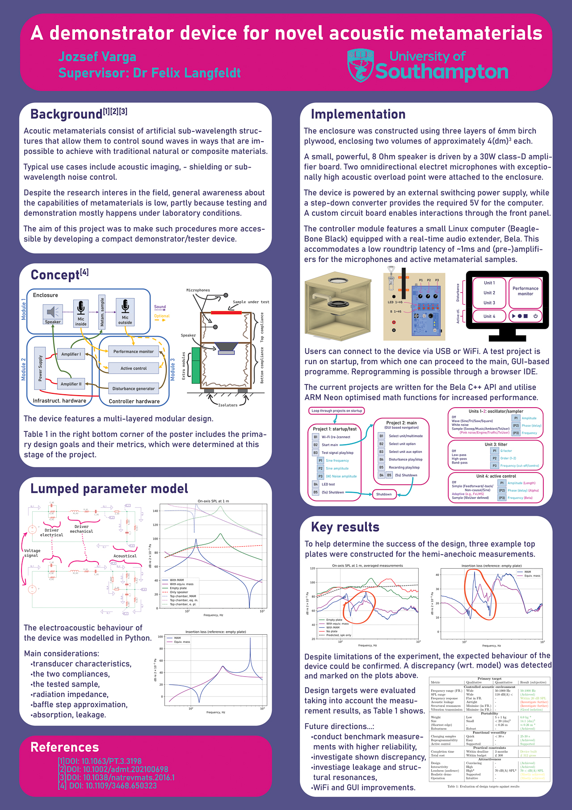
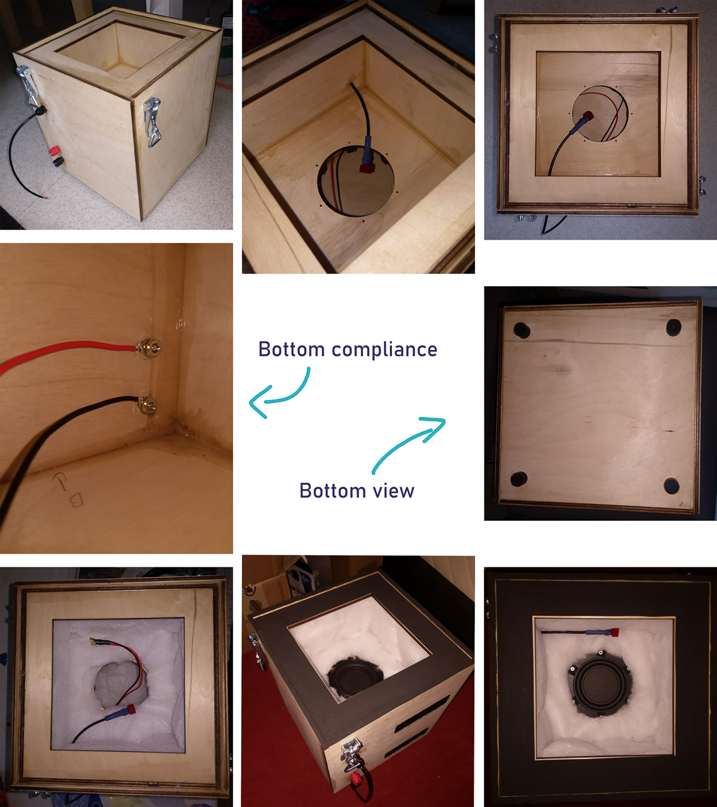
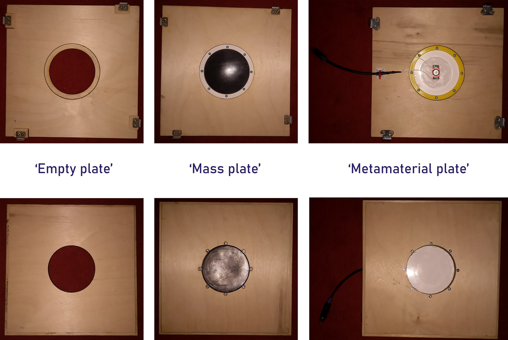
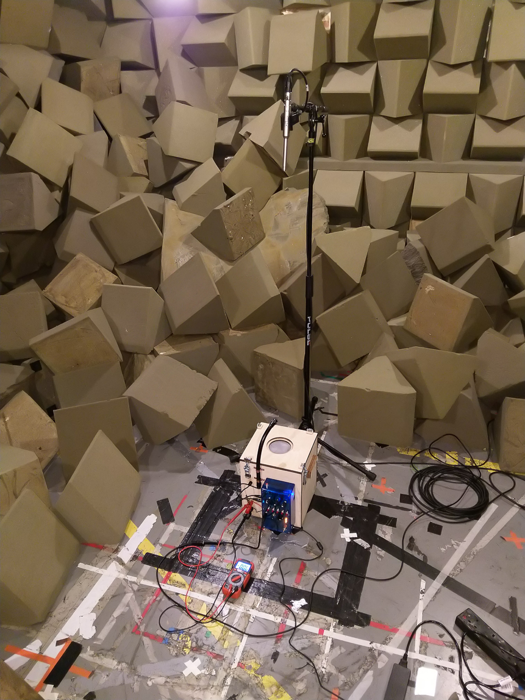

:::note
As this project formed the basis of my MSc thesis, the presented work is property of the University of Southampton.
:::

In brief, this device is a portable, real-time electroacoustic control system with data acquisition capabilities. It provides acoustic excitation to the (active) metamaterial sample in a controlled environment. The response is recorded and/or used to generate an additional real-time control signal to the sample.

The enclosure was designed based on custom Python simulations. The controller hardware features a BeagleBone SBC and a Bela extender running Xenomai and Linux. The performance of the finished device was benchmarked by measurements in a hemi-anechoic chamber.

Please refer to the poster below for context and details. Additional pictures of the building procedure and the finished device are also included.

## Poster

## Construction of the enclosure

## The completed device with no top plate attached

## Example top plates

## Hemi-anechoic measurements

